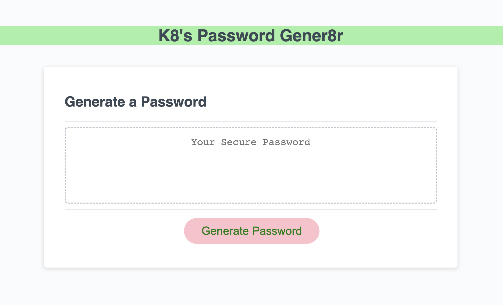

# K8's Password Gener8r

## Description

Hello! My name is Kate (K8), and I made this web application to generate random passwords based on user input. I used JavaScript to make the generator interactive and user friendly, prompting the user to enter desired criteria as well as redirecting the user if done incorrectly. It would be a great tool for employees with access to sensitive data who need to create a strong password. 

💝 [Check out my password generator here](https://k8sterchi.github.io/gener8r/) 💝

## Application Preview

## User Story

> AS AN employee with access to sensitive data
I WANT to randomly generate a password that meets certain criteria
SO THAT I can create a strong password that provides greater security

## Acceptance Criteria
> * GIVEN I need a new, secure password
> * WHEN I click the button to generate a password
> * THEN I am presented with a series of prompts for password criteria
> * WHEN prompted for password criteria
> * THEN I select which criteria to include in the password
> * WHEN prompted for the length of the password
> * THEN I choose a length of at least 8 characters and no more than 128 characters
> * WHEN asked for character types to include in the password
> * THEN I confirm whether or not to include lowercase, uppercase, numeric, and/or special characters
> * WHEN I answer each prompt
> * THEN my input should be validated and at least one character type should be selected
> * WHEN all prompts are answered
> * THEN a password is generated that matches the selected criteria
> * WHEN the password is generated
> * THEN the password is either displayed in an alert or written to the page

## Helpful Resources...

[🚀 Starter Code found here.](https://github.com/coding-boot-camp/friendly-parakeet) 

Searching JavaScript's standard built-in objects and methods helped me create the code for randomizing the password generator. I ended up using `math.random()` and  `math.floor()`. 

Below is a link to the math built-in object as well as links to the specific methods I used with `math`:

[🚀 `math`](https://developer.mozilla.org/en-US/docs/Web/JavaScript/Reference/Global_Objects/Math) 

[🚀 `math.random()`](https://developer.mozilla.org/en-US/docs/Web/JavaScript/Reference/Global_Objects/Math/random)

[🚀 `math.floor()`](https://developer.mozilla.org/en-US/docs/Web/JavaScript/Reference/Global_Objects/Math/floor)

[🚀 This forum](https://stackoverflow.com/questions/2450954/how-to-randomize-shuffle-a-javascript-array) and [🚀 this forum](https://stackoverflow.com/questions/4550505/getting-a-random-value-from-a-javascript-array) helped me as I was trying to understand how to change my pseudo code into JavaScript. 

[🚀 This YouTube video](https://www.youtube.com/watch?v=x4HUaiazDes) helped me get started by guiding me through the importance of pseudo-coding as a way to begin mapping out what you want your code to accomplish. 